# Conquistador_01
Introduction  
This is the Application through which students can log in to their dashboard and keep track of
upcoming interviews, submitted applications, and view company-wise eligibility. Here, Admins can upload upcoming placement drives, company eligibility, control applications, and student databases.  
This system is designed to streamline the placement process for organizations and institutions. It helps in managing the placement drive by automating various tasks such as student registration, company registration, and generating placement reports.

Features  
Student registration and profile management  
Company registration and profile management  
Scheduling interviews and tracking interview status  
Generating placement reports  
Email and SMS notifications for students and companies  
Admin panel for managing the system  

Additional Features  
Chat-Bot to know more about the Website   
Speech recognition in the Chat-Bot  
Create and Download Resume.   

Technologies Used    
Frontend: HTML, CSS, JavaScript, Bootstrap  
Backend: PHP, MySQL  
Machine Learning: Dialog Flow  

ScreenShots

Home Page

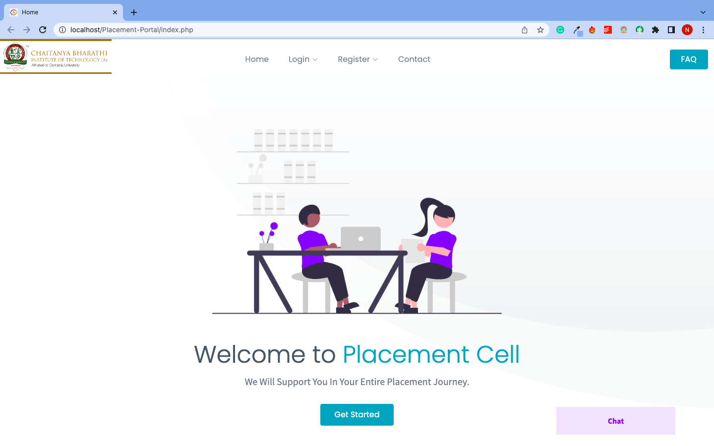

Statistics

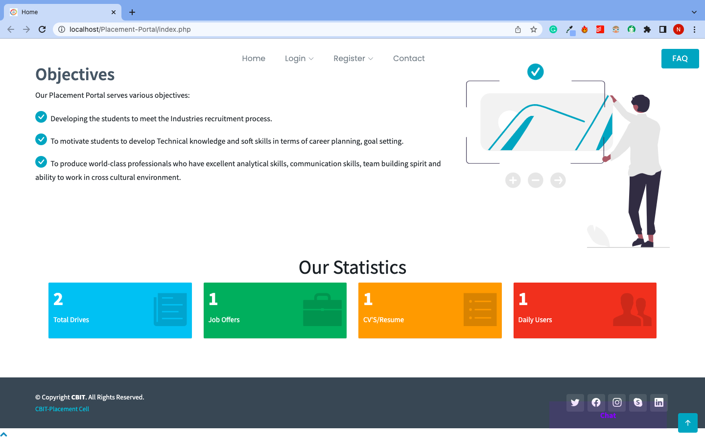

Chat Bot

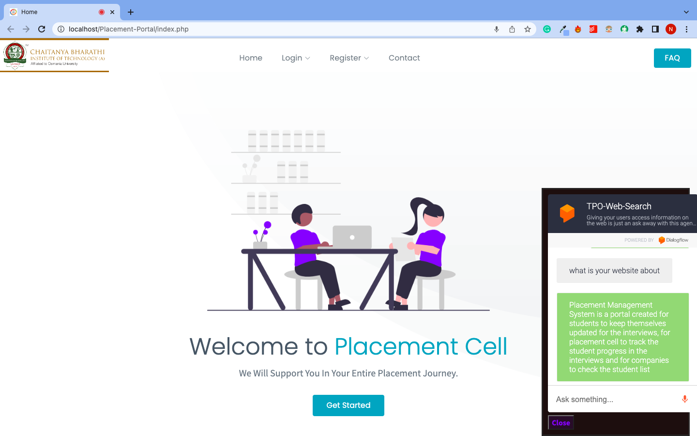

Contact Us

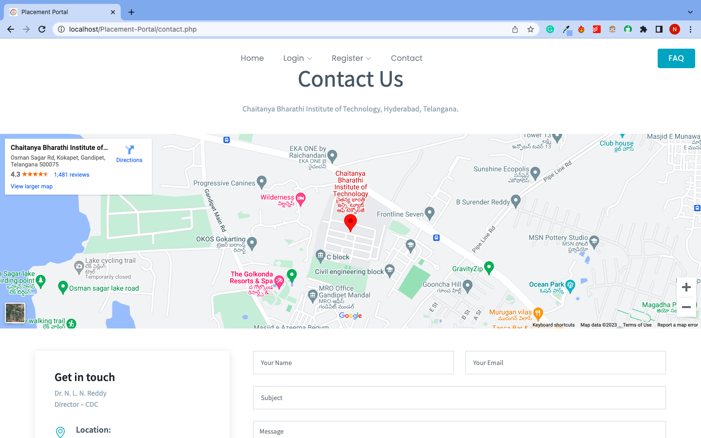

Login Page

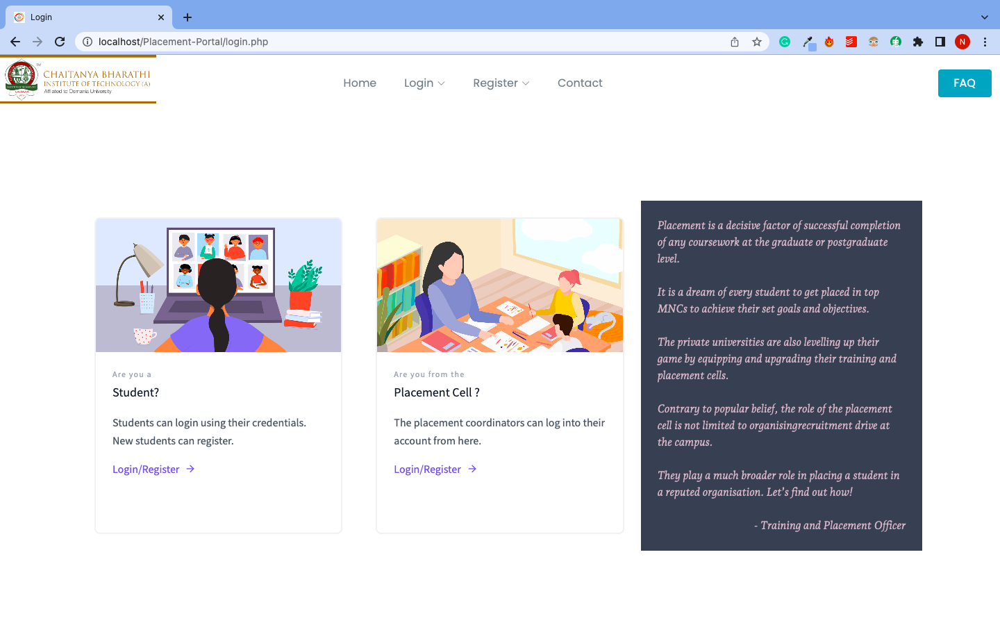

Admin Login

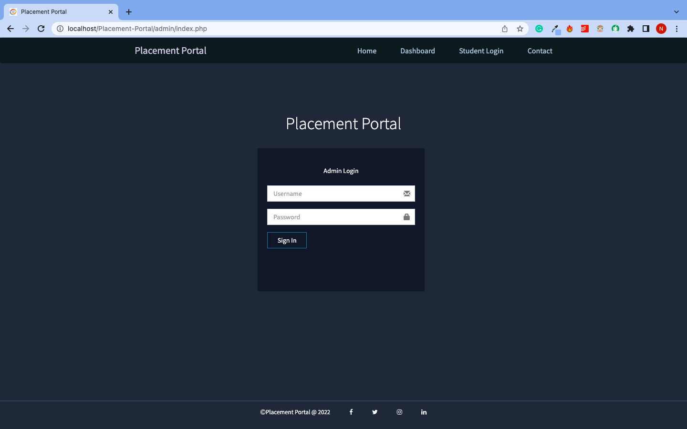

Admin Dashboard

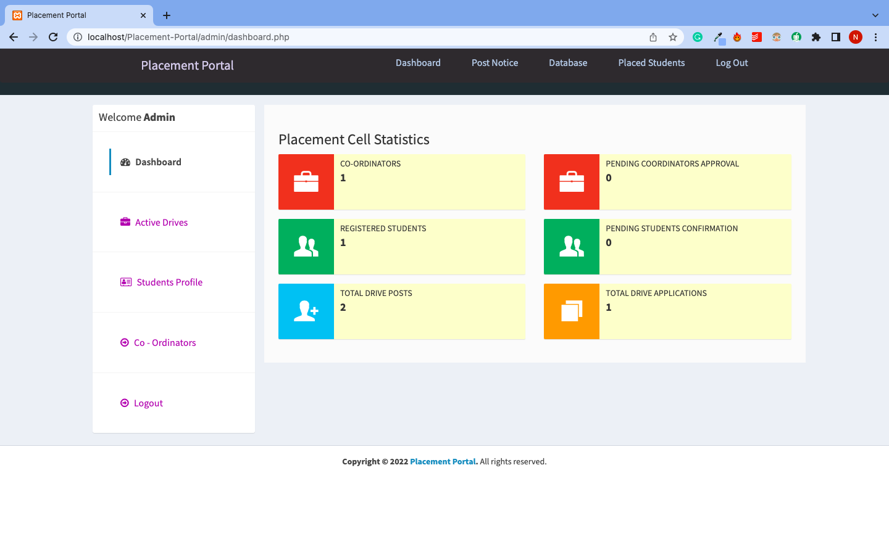

Admin Drives

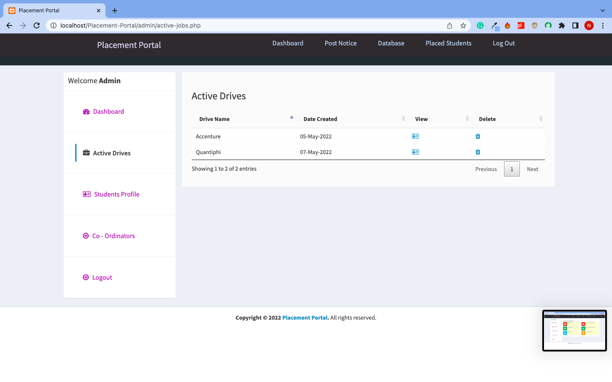

Admin acceptance to student

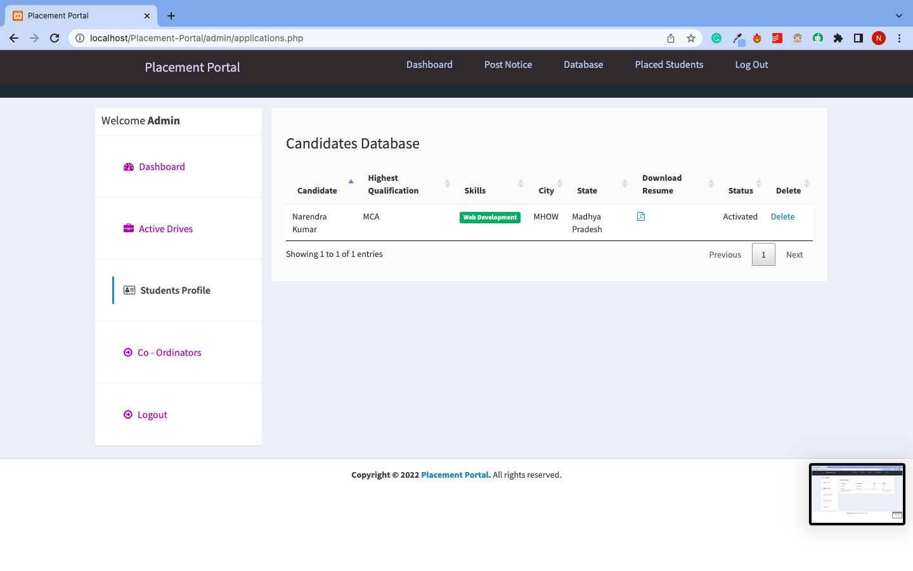

Admin acceptance to company

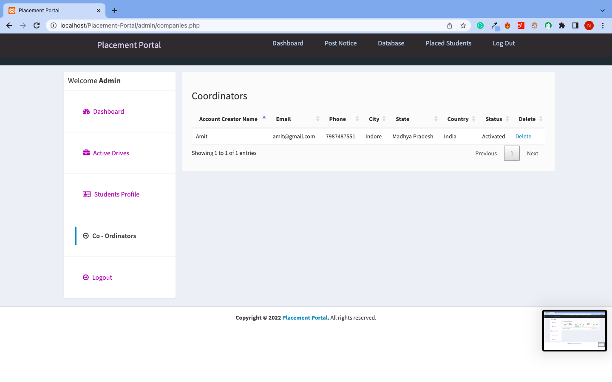

Notice issued by admin

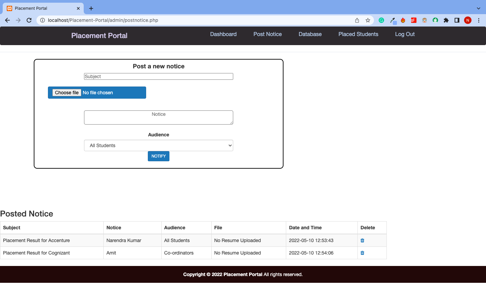

Student Login

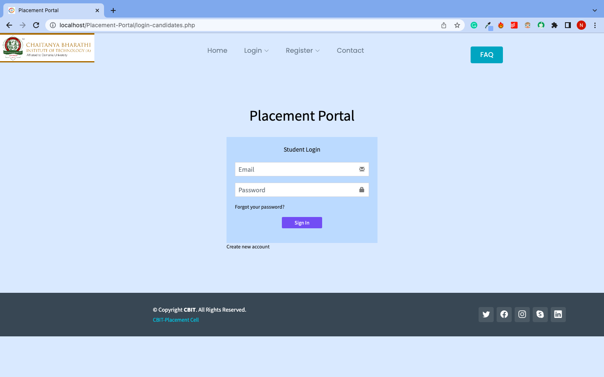

Student Registration

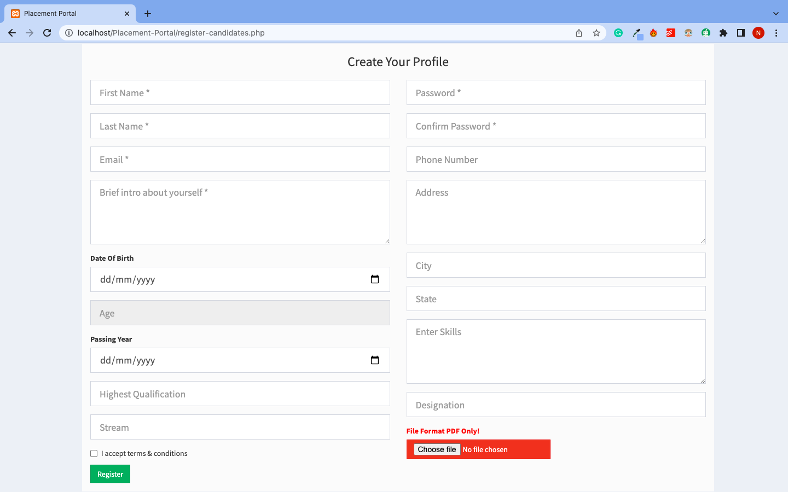

Drives for Student 

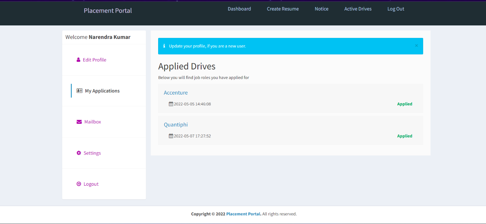

Eligibility for Student

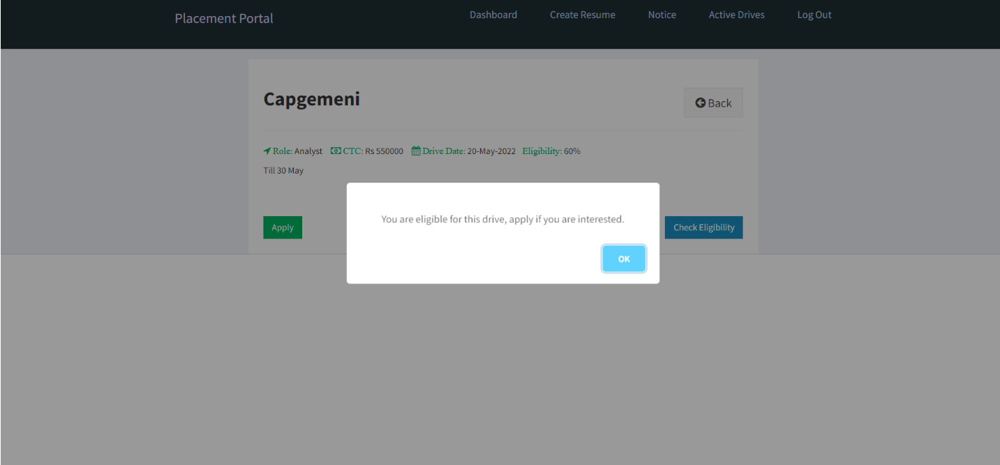

Resume Builder for Student

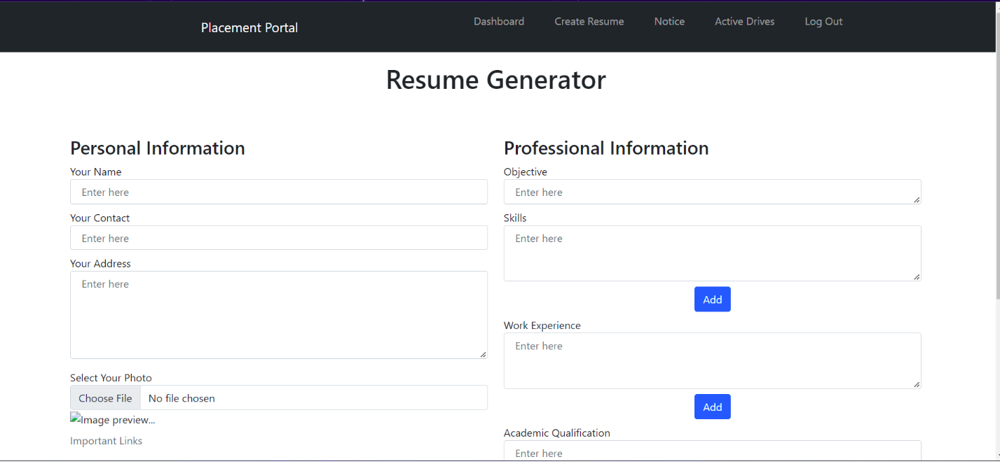

Placed Student List

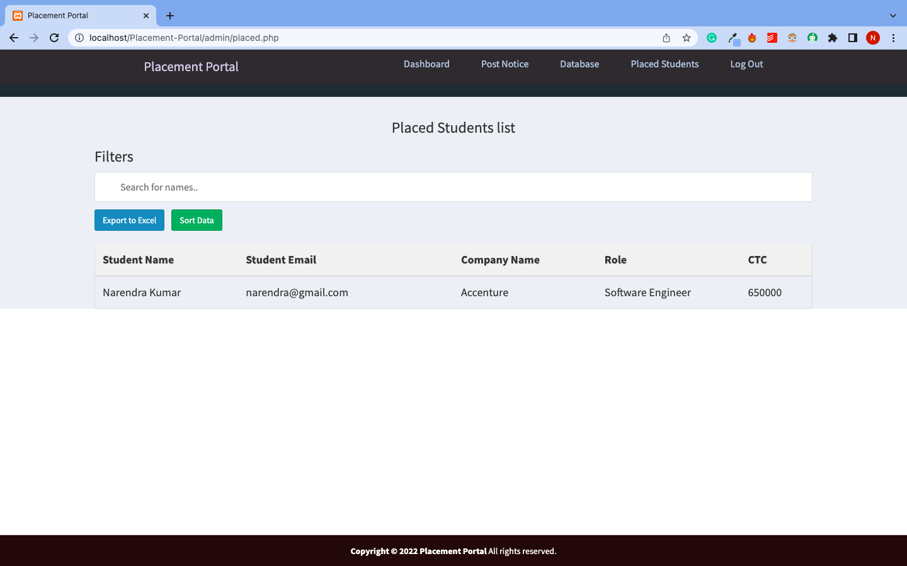

Requirements  
Web Server (Apache, Nginx)  
PHP 7.0 or higher  
MySQL 5.6 or higher  

Installation  
1. Install XAMPP or WAMPP.

2. Open XAMPP Control Panel and start [Apache] and [MySQL] .

3. Download project from github(https://github.com/Sanketh149/Conquistador_01).

OR follow git-bash commands

i> cd C:\\xampp\htdocs\

ii> git clone https://github.com/Sanketh149/Conquistador_01.git

4. Extract files in C:\xampp\htdocs.

5. Open link localhost/phpmyadmin

6. Click on new at side navbar.

7. Give a database name as (placement_portal) hit on create button.

8. After creating database name click on import.

9. Browse the file in directory [placement-portal/database/db1.sql].

10. Open any browser and type http://localhost/placement-portal.

Contributing  
This project is open for contributions. If you want to contribute, please follow the guidelines in the CONTRIBUTING.md file.

License  
This project is licensed under the MIT License. Check the LICENSE.md file for details.
